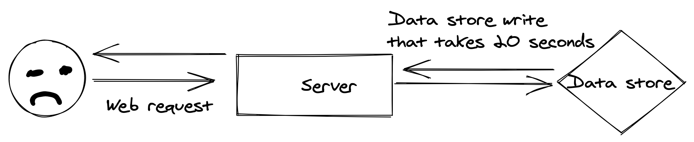

Queues are the backbone to asynchronous communication and message passing in any application of consequence. And yet, they're not as understood as they should be. I had no exposure to queues or queueing technology in my university studies (and mind you, I don't mean the data structure — I listened to plenty of lectures about the data structure). I was first exposed to a queue in my second dev job, and even then, I used it without regard about what it was doing under the hood because somebody told me to.

At its most basic definition, **a queue takes a message (work) and defers processing of that message to a later time.** A benefit of this message/work deferment dichotomy is that you can also use queues to pass messages between services in an async manner. One service can produce work and another can pick up that work later.

This type of communication is essential in a network or web context, especially for customer facing applications. For example, if there is an HTTP request that kicks off a bit of backend work that takes several seconds (or minutes) to complete, it's excruciating for the user to just… sit there. Especially if there is no sort of feedback in the way of a progress bar or something.

 *This feels like purgatory*

A better UX is to complete the hard work later, or at least, not in the same thread as the synchronous HTTP request. A user kicks off the HTTP request -> the heavy lifting is encapsulated in a message and shoved into a queue -> the HTTP request ends with the user only having sat there for milliseconds.

![goodexperience][goodux] *This is UX that gets out of your way.*

The salient point here is work that doesn't need to be synchronous can be deferred until later. Keep your folks happy.

That being said, there are several paradigms or patterns that exist in the async execution space. Here are a few high level overviews of stuff I've dabbled in:


## Task Queues

The traditional task queue is used for processing unordered long running events and/or for async message passing between network segmented services. Once upon a time I worked at a startup that used a task queue for both purposes. The company was in the business of "bringing back home movies" (a failed venture in the year of our lord 201X). As part of that, users would upload pictures and videos that were edited into a single "movie". Once that was done, the movie needed to be burned onto a DVD complete with chapters, authoring, etc.

We had a DVD authoring service living on a server rack in a dingy warehouse balanced on a barstool that was set up to listen to an Amazon SQS queue. Any time a message was published to the queue, the service would grab the message, get all the necessary data from the message, and start burning a DVD. This is a rough example of what the queue message looked like:

```json
{
  "customer-id": 123-456-789,
  "file-path": "/customers/123-456-789/magic-movie.mp4"
  "cover-art": "/customers/123-456-789/cover.png"
  "title": "Johnson Family Disney Trip 2017"
}
```

The service would fetch the necessary files from a Google Cloud Storage bucket out in the ether (we were usin' Firebase as our platform) and begin the work.

Burning DVDs even at a micro-scale was a bit of work was made possible and easier by deferring work until later and leveraging a sort of "at-the-server's-pleasure" approach. The burning and authoring of the DVD's was a time-consuming process. We had these… DVD burning "robots", for lack of a better term, that were tailor-made for mass DVD production. Work was kicked off by invoking a command on the robot's terminal with an XML file defining the DVD structure. The entire DVD making process probably took less than half an hour. That isn't a lot of time in the normal everyday human perception of things. But in the context of a web application, it can be forever. If the entire process was synchronous (upload to completed DVD), we wouldn't have had any customers or a semi-compelling product.

![dvd-task-queue][dvdq] *A simplified version of DVD authoring*

Another benefit to task queues is the ability to scale up the number of workers consuming messages from the queue. At one point we had enough customers creating DVDs at the same time that the single DVD authoring worker couldn't keep up with both customer demand and our shipping guarantees. We were fortunate to have a glut of the DVD burning robots in the warehouse. All we had to do was create more worker processes on the precariously balanced server and SQS handled the rest.

## Pub/Sub

Pub/Sub messaging, short for publish/subscribe messaging, is a sort of cousin to task queues in that you can use 'em for async communication, but that's where the similarities end. Pub/sub messaging is a messaging passing mechanism where a **pub**lisher will write a message to a topic (a place for a specific type of message) and **sub**scribers to the topic will pick up the message at their leisure and do stuff.

By design, this paradigm encourages a one-to-many relationship between publishers and subscribers and a fanout of the original message. A publisher will throw a message into a particular topic, usually when something happens (`UserSignedUp` or something). Different disparate parts of an application might care that a user has signed up and can subscribe to the `UserSignedUp` topic and do whatever it is they need to do based off that message. A part of the application that cares about email might send off a welcome email, a different part of the application might create user specific resources, and yet another part of the application might alert an implementation rep. All of these parts of the application are separate from one another and should be kept that way. They shouldn't know or even care what other services do when a user signs up. And that's the beauty of pub/sub messaging — you can keep different areas of responsibility loosely coupled from each other, defer execution of a message to different parts of the application, let them act on the message on their time table, and keep the UX tight and responsive.

There are a few challenges to crafting a good pub/sub experience, but they're akin to the challenges of creating a good relational database schema. Because you have many consumers to a single topic, and each consumer in theory is doin' their own thing, you need to keep the message going into the topic general enough that different services can use it effectively, but also focused enough that you're not mixing in hyper-specific bits of data that a single service cares about. Backwards/forwards compatibility, validation agnosticism in services to message bits they don't care about, message ordering considerations, and more, are all problems that have to be accounted for in a useful pub/sub system, but I'm not gonna dive that deep.

Surprise, surprise, we also leveraged pub/sub messaging at the defunct startup.

It turned out that DVDs weren't a compelling enough product, or rather, they were a product without product-market fit. We decided to supplement the DVD hard copies with Firestick and Roku applications — folks were then able to stream their magical home movies in a kind of personal netflix app (which was actually a fun and enlightening process to build out). This addon introduced a new problem; most streaming applications support varying levels of video quality (480p, 720p, 1080p, 4k, etc). Modern phones are able to take high fidelity videos and we needed to deliver that experience. However, we also needed to provide different levels of quality for folks who were in places without a great or stable network. We leveraged AWS's elastic transcoder to give us a handful of video qualities.

![pub/sub][pubsub] *Pub/sub authoring and transcoding*

Now when a user's files were all uploaded, we used Google Pubsub to publish an `UploadDone` message. There were two consumers to the message. One would kick off the transcoding jobs. The other tiny one translated the message and stuck it into the SQS queue for DVD authoring. Streaming video transcoding and DVD authoring don't care about each other, don't need to happen at the same time, and don't ever need to talk to each other, but were central pillars to the business. Pub/sub messaging allowed us to serve both needs with ease and flexibility.

## Event Streaming

Event streaming is an implementation of Pub/sub. On steroids. It introduces time and some interesting aggregation possibilities to the mix. An event stream is a sequence of events over time. In traditional queueing (like a task queue), a worker reserves a message, does whatever necessary work it needs to do based on the message, and then "consumes" or deletes the message off the front of the queue. This is to guarantee that work isn't duplicated (which is something you'd want with a task queue). Event streams don't work the same way. Instead, messages are long-lived in a stream/["log"][logstream] data structure. Messages can be worked multiple times by different consumers.

In an ideal world, messages would never be consumed or fall off the log; any consumer that cares about a particular topic would be able to ingest the entire log stream from the beginning of time and eventually end up in an up-to-date state. That's not feasible because storage concerns are a reality. Most event streaming platforms support time-based expiry of messages (e.g "pop off the queue after 2 days") as well as log compaction.

On a regular interval, some process will get rid of messages that don't really alter the current state of the log. Imagine that there's a topic for incrementing and decrementing a counter by one — if there are three messages that decrement counter interspersed with four messages that increment, the current state of the counter is 1. This nullifies the need for most of the decrement messages and the majority of the increment messages. A log compaction algorithm can get rid of superflous messages but it's important to remember that there is data loss, regardless of the current state of the counter; when the messages were fired, the frequency of increment vs. decrement, etc, these are all insights that can be gleaned from the messages.

That data loss also affects some cool stream processing actions. Again, in a traditional queue setup, messages are reserved, worked, and discarded. Stream processing preserves that long-lived sequence of events allowing folks to transform or work against the stream. Aggregate functions are a common use against streams. For example, imagine that there's a stream of ecommerce purchases that have a timestamp, total cost of the purchase, and other pertinent data. An analyst might want to know what the most expensive item purchased in the last couple hours was (a `max()` function) — totally possible with long-lived log of events. Another analyst might want to see how many times item X was purchased over labor day weekend, or somebody else might want to run a map-reduce function against the stream to calculate total tax, or who knows what else. The point is, event streams support this type of workflow where other queue paradigms don't.

Event streams naturally evolved from batch processing. Batch processing is taking a certain subsection of data or work (a batch) and working against this (and other batches) over an interval. With streams, the interval just happens to be "always". And naturally, the company I currently work for needed the functionality provided by event streaming platforms.

![events][eventstream]

For a while we were performing a heavy ETL process for gathering key user stats and sticking those stats into another (highly used) database and using a particular table as a pseudo-data warhouse. If you're unfamiliar with the acronym, ETL stands for "Extract, transform, load". You extract some data from somewhere, normalize and massage that data into the shape you need, and then load it elsewhere. By convention this happens in batches. And we were leaning into the conventional approach. Every couple of hours a `SELECT` query ran against a subset of our customer data and loaded it up elsewhere. A particular user's data would be processed 5-6 times a day. The volume of queries and writes against the transactional database started to tank it's performance, and by natural consequence, it started to tank the user experience. We were performing these heavy operations against our production databases (sometimes during peak hours) and then generating reports (again, sometimes during peak hours). This might work fine with a small subset of data or when a company is starting out, but it starts to get heavy once a semblance of scale is approached.

We stumbled on the concept of "change data capture" while looking up bitemporal tables. The gist of CDC is that you "capture" changes as they happen to your data set. We prototyped a CDC setup by dropping [Debezium][dbzm] into our stack. It read from our MySQL binlogs given some rulesets and pushed an event to a Kafka stream on DB writes. We then setup a few Python consumers to remix and massage the data to be dumped into a region specific data warehouse (we've got multiple AWS regions to better service our customers/meet legal compliance. The same data shouldn't leave a region unless anonymized). With these tools we were able to stream database changes in real-time to a single place — reports could now be run against this data warehouse without affecting production load. Even better, we can run a more traditional ETL process against these warehouse (while anonymizing personally identifying information) and feed the regional data into a pool of data representing all users.

The results were much happier databases and a better user experience. Beyond that, we've started unlocking all sorts of insights via stream processing that we couldn't from a normal database — remember, a database captures the _current_ state of the application, where a stream/log gives the state of the application _over time_. It's a subtle distinction but one with implications around user and system behavior.

## Que queue quieres?

 I'm lookin' at this draft and I feel like it's pretty long (clocking in at 2,390 words so far) but we're still in the kiddie pool in terms of depth on the topic (wakka wakka) of queues. Concepts like retry guarantees, throughput considerations, backpressure, message routing, etc, are also central to some of the paradigms above and could probably be their own writeup.

It can get overwhelming.

Asynchronous messaging and deferred work are critical to the success of an application on the up-and-up. I'm hoping that this is a brief enough introduction to some of the queue stuff I've interacted with, and I'm hoping that the concrete examples help clarify what should be used where.

[badux]: ../../assets/badux.png
[goodux]: ../../assets/goodux.png
[dvdq]: ../../assets/dvd-task-queue.png
[pubsub]: ../../assets/pubsub.png
[logstream]: https://engineering.linkedin.com/distributed-systems/log-what-every-software-engineer-should-know-about-real-time-datas-unifying
[eventstream]: ../../assets/eventstream.png
[dbzm]: https://debezium.io/
